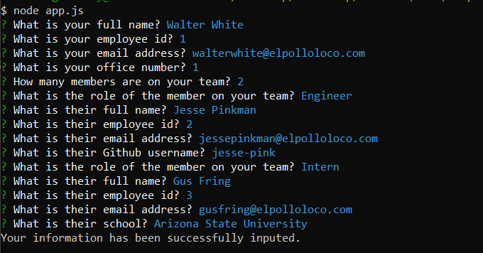

# Template-Engine-Employee-Summary

## Description: 

In this project, I am rendering an HTML page based off user input using the node.js packages inquirer, path, and fs. It starts the prompt off tailored to a manager and asks the manager to input some questions along with how many team members they have. From then, the questions are customized for the type of team member the manager is inputting (engineer or intern). The information collected will then trigger an Output folder to create that will render a team.html page within it styled by Bootstrap. This is what we can then use to view the webpage displaying all the team mates.

## A couple of things I learned in this:

* Asynchronous functions without explicit .then promises. So instead utilizing asynch await functionality.
* Adding validations to inquirer prompts. I did not necessarily use regex, but I did get it to work with isNaN.
* path.resolve(__dirname, "output") provides absolute path for a segment/file. https://nodejs.org/api/path.html#path_path_resolve_paths
* path.join(output, "team.html") joins all paths together. https://nodejs.org/api/path.html#path_path_join_paths
* fs.existsSync() to check if a file or folder exists with that name in the path https://nodejs.org/api/fs.html#fs_fs_existssync_path
* fs.mkdirSync() to create a new directory asynchronously https://nodejs.org/api/fs.html#fs_fs_mkdir_path_options_callback

## Installation:
If you need to pull my code for this homework, please visit my Github repository at: https://github.com/selma-e/Template-Engine-Employee-Summary

From there, you can git clone my repository locally to run the project. You will need to do the following node commands:
1) npm i (to install all dependencies)
2) node app.js (to run the program). Once the program is run, you will have an output folder with a team.html to view.

## Usage: 

## Resources Used/Credits:
* Bootstrap https://getbootstrap.com/docs/4.0/getting-started/introduction/
* Node.js https://nodejs.org/en/
* Garima Gupta's Slack suggestion to add the fs.existsSync and fs.mkdirSync.

© 2020 Selma Elgabalawy | UW-SEA-FSF-PT-08-2020-U-C-TTh
